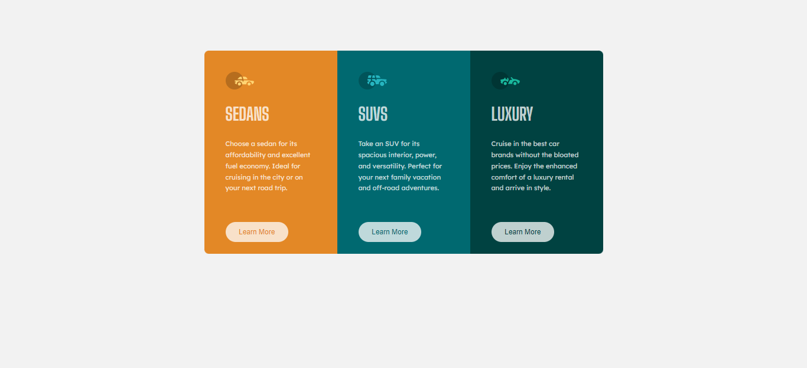

# Frontend Mentor - 3-column preview card component solution

This is a solution to the [3-column preview card component challenge on Frontend Mentor](https://www.frontendmentor.io/challenges/3column-preview-card-component-pH92eAR2-). Frontend Mentor challenges help you improve your coding skills by building realistic projects.

## Table of contents

- [Overview](#overview)
  - [Screenshot](#screenshot)
  - [Links](#links)
- [My process](#my-process)
  - [Built with](#built-with)
- [Author](#author)

## Overview

### Screenshot

### Links

- Solution URL: [Git](https://github.com/ern2dv/fm-solution-2)

## My process

### Built with

- Flexbox
- CSS Grid

## Author

- Website - [Jegor Bondarenko](https://www.linkedin.com/in/yehor-bondarenko/)
- Frontend Mentor - [@ern2dv](https://www.frontendmentor.io/profile/ern2dv)
